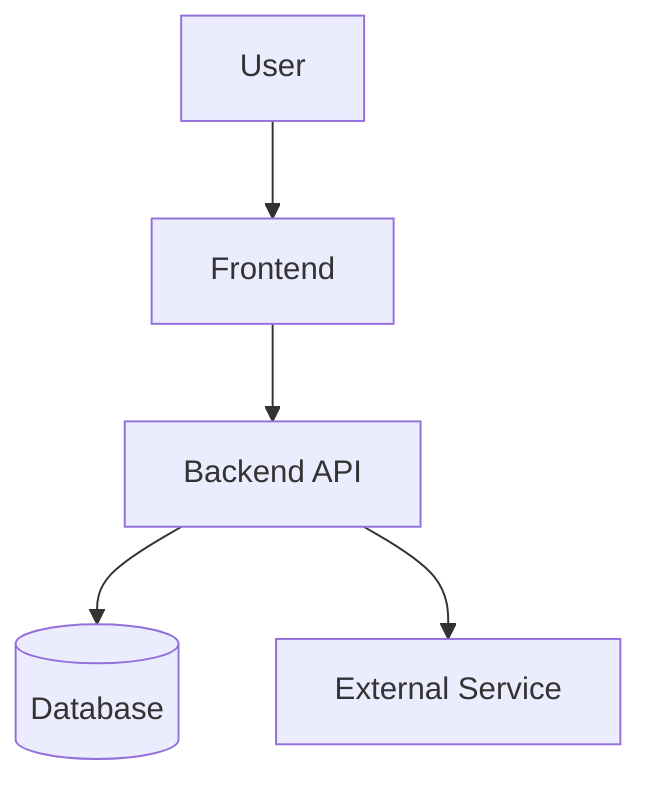

# {{Product Name}} — Architecture (Deep)

**Step 2 — Design** | **Source of truth for the architecture.** The companion summary at [ARCHITECTURE-summary.md](./ARCHITECTURE-summary.md) is a derivative view — it never adds information that isn't here.
**Contributed by:** Product owner + technical collaborators

This document is the actual architectural blueprint. Step 4 (Build) reads it when implementing. Other design docs cross-link into specific sections of this doc when they need to reference architectural decisions.

If the summary and this doc disagree, the **summary is wrong** — regenerate the summary; do not edit this doc to match the summary.

---

> **Claude Guidance:** Start by reading the **Constraints & Values** section of `PRODUCT_OVERVIEW.md` before making any recommendations — the user's licensing intent, privacy stance, and infrastructure preference should shape every architectural suggestion.
>
> **Workflow:** Build this doc *first*, walking the user through each section conversationally. Once it is signed off, generate [ARCHITECTURE-summary.md](./ARCHITECTURE-summary.md) as a faithful condensation. Never reverse the order.
>
> **Section anchors:** This doc's sections will be cross-linked from the summary and from other design docs. Use stable, slug-friendly section headers; avoid renaming them once the summary references them.
>
> **Safety-first defaults:** Lead with the simplest, cheapest, least-infrastructure-heavy option that meets the product's needs. Specifically:
> - Prefer **managed/hosted** services (Supabase, Vercel, Netlify, Railway, Neon) over self-hosted infrastructure
> - Prefer **fewer external services** — every third-party integration is a credential to manage, a potential outage, and a data-sharing decision
> - Prefer **established, well-maintained open-source libraries** over newer or proprietary ones — especially for auth
> - Flag **cost implications** clearly: free tiers, pricing cliffs, and what happens when the product scales
> - Flag **data residency and privacy implications** for any service that stores or processes user data
> - For **licensing compatibility**: check the user's chosen license against any dependencies — GPL/AGPL libraries in a closed-source product can be a problem
>
> Help the user think through: Where does the product run? Does it need a backend? A database? Third-party services? Draw out the architecture in Mermaid before filling in prose. When choices involve tradeoffs, explain them in plain language and let the user decide.

---

## System Overview

*A paragraph or two summarizing the overall architecture — what exists, how it fits together, and the key design philosophy. The summary will distill this into one sentence; here, give it the room it needs.*

## Architecture Diagram

*A detailed Mermaid diagram showing the major components, data flows, and external integrations.*

## Components

*For each major system or service, describe what it is, what it does, and why it exists.*

### Frontend

*What technology, where it runs, what it's responsible for, and any notable libraries or frameworks.*

### Backend / API

*What technology, where it runs, what it exposes, and what it's responsible for.*

### Data Storage

*Where data lives, what kind of store it is (relational, document, etc.), and why that choice fits the product.*

### External Services

*Third-party APIs, platforms, or services the product depends on, and what role each plays.*

## Key Technical Decisions

*The most important architectural choices made, and the reasoning behind them. Step 4 (Build) reads this section before making implementation decisions. The summary will lift its three highest-priority bullets from here.*

## Known Constraints and Tradeoffs

*What this architecture is not optimized for. What would need to change as the product scales. The summary's "what this rules out" paragraph distills this section.*

## Implementation Notes

*Build-phase guidance: file layout conventions, environment variable expectations, deployment specifics, common pitfalls. AI doing the build should read this section before writing code. This section is **not** condensed into the summary — it lives here, build-side only.*

---

## Related

- [ARCHITECTURE-summary.md](./ARCHITECTURE-summary.md) — the derivative one-screen view (regenerated from this doc)
- [Design README](../../README.md)
- [DATA_MODEL-deep.md](./DATA_MODEL-deep.md)
- [SECURITY_PRIVACY-deep.md](./SECURITY_PRIVACY-deep.md)
- [LICENSING.md](../../LICENSING.md)
- [diagrams/](../../diagrams/)
