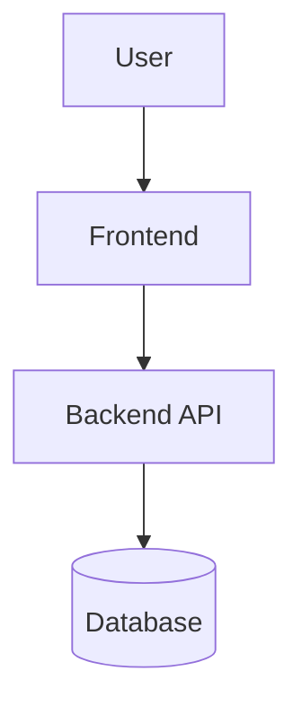

# {{Product Name}} — Architecture Summary

**Derivative view of [ARCHITECTURE-deep.md](./ARCHITECTURE-deep.md).** This file never adds information that isn't in the deep doc. If they disagree, this file is wrong — regenerate it from the deep doc.

For full technical detail, including Implementation Notes that drive Step 4 (Build), open the deep doc.

---

## The picture

## What this does

*One sentence distilled from the deep doc's [System Overview](./ARCHITECTURE-deep.md#system-overview).*

## Key decisions

*Three bullets max. Each cites the deep-dive section where the full reasoning lives.*

- ***Decision:*** *e.g., "Managed Postgres via Supabase" — **Why:** "Free tier, no servers to operate."* — see [Data Storage](./ARCHITECTURE-deep.md#data-storage)
- ***Decision:*** *…* — see [Backend / API](./ARCHITECTURE-deep.md#backend--api)
- ***Decision:*** *…* — see [Key Technical Decisions](./ARCHITECTURE-deep.md#key-technical-decisions)

## What this rules out

*One paragraph distilled from the deep doc's [Known Constraints and Tradeoffs](./ARCHITECTURE-deep.md#known-constraints-and-tradeoffs). The most important tradeoff, in plain language.*

## What's next

- Full technical detail and implementation notes: [ARCHITECTURE-deep.md](./ARCHITECTURE-deep.md)
- What flows through these pieces: [DATA_MODEL-summary.md](./DATA_MODEL-summary.md)
- Security implications: [SECURITY_PRIVACY-summary.md](./SECURITY_PRIVACY-summary.md)

---

> **Claude Guidance:** This is a derivative view. Generate it *after* the deep doc is signed off, by walking through the standard summary shape and lifting condensations from the deep doc's sections. Never write the summary first. Never let the summary drift from the deep doc — re-validate after any deep-doc edit. The user's signoff on the summary is a signoff on a faithful view of the deep doc; the deep doc is what they're actually committing to.
