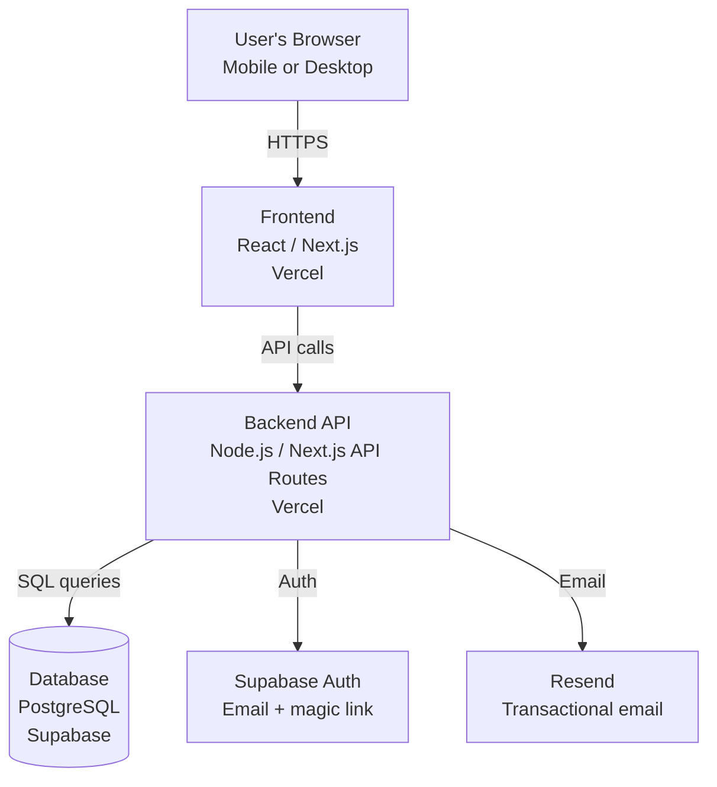

# ARCHITECTURE.md — NeighborBoard Example

> This is a filled-in example. See the blank template at [`02-design/ARCHITECTURE.md`](../../02-design/ARCHITECTURE.md).

---

## System Overview

NeighborBoard is a simple three-layer web app: a browser-based frontend, a backend API that handles business logic and authentication, and a relational database that stores all content. The architecture is intentionally minimal — a small community app doesn't need microservices or complex infrastructure. The priority is low cost, easy deployment, and straightforward maintenance by a non-engineer with Claude's assistance.

## Architecture Diagram

## Components

### Frontend
A React / Next.js web app hosted on Vercel (free tier for MVP). Renders the event feed, post forms, and RSVP buttons. Designed mobile-first. Communicates with the backend via API routes built into Next.js — there is no separate backend server to manage.

### Backend / API
Next.js API routes handle: creating and reading posts, processing RSVPs, and sending email notifications. Running on the same Vercel deployment as the frontend — no separate server to set up or pay for.

### Data Storage
PostgreSQL database hosted on Supabase (free tier for MVP). Supabase also provides authentication (email + magic link — no passwords to manage) and a web dashboard for viewing the database without writing SQL.

### External Services

| Service | Purpose | Cost |
|---------|---------|------|
| Vercel | Hosting (frontend + API) | Free tier sufficient for MVP |
| Supabase | Database + authentication | Free tier sufficient for MVP |
| Resend | Transactional email (notifications, magic links) | Free tier: 100 emails/day |

## Key Technical Decisions

**Next.js over separate frontend/backend:** Reduces the number of things to deploy and maintain. For a small app, having API routes alongside the frontend in one codebase is simpler and cheaper.

**Magic link auth (no passwords):** Users get a login link emailed to them. No password reset flows to build, no passwords to store or hash. Right for a low-stakes community app where convenience matters more than strict security.

**Supabase over raw PostgreSQL:** Provides a managed database with a UI, built-in auth, and real-time capabilities — without needing to manage a server. Free tier is generous for MVP scale.

**Vercel over self-hosting:** Zero-config deployment from GitHub. Free tier handles the traffic of a single neighborhood. Can scale if needed.

## Known Constraints and Tradeoffs

- **Vercel free tier limits:** Serverless function execution time is capped. Won't matter for MVP but could be an issue if email sending becomes slow.
- **Supabase free tier pauses:** Projects on the free tier pause after 1 week of inactivity. Fine for a pilot but needs upgrading ($25/month) for a live neighborhood.
- **No real-time feed updates:** The feed doesn't auto-refresh when someone posts. Users need to reload. Acceptable for V1; real-time can come later.
- **Single neighborhood:** The current architecture has no multi-tenancy. Supporting multiple neighborhoods would require a schema change and routing logic.

---

## Related

- [DATA_MODEL.md](./DATA_MODEL.md)
- [SECURITY_PRIVACY.md](./SECURITY_PRIVACY.md)
- [Blank ARCHITECTURE.md template](../../02-design/ARCHITECTURE.md)
