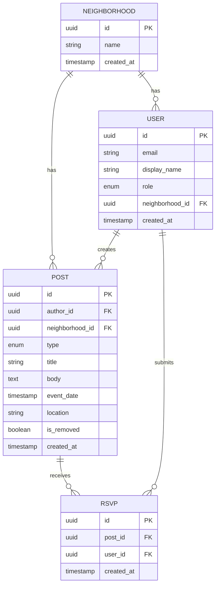

# DATA_MODEL.md — NeighborBoard Example

> This is a filled-in example. See the blank template at [`02-design/DATA_MODEL.md`](../../02-design/DATA_MODEL.md).

---

## Entities

### User
A registered resident of the neighborhood.

| Field | Type | Description |
|-------|------|-------------|
| id | UUID | Primary key |
| email | string | Login identifier; never shown publicly |
| display_name | string | How they appear on posts (e.g., "Sarah from Elm St") |
| role | enum | `resident` or `admin` |
| neighborhood_id | UUID | Which neighborhood they belong to |
| created_at | timestamp | When they joined |

### Neighborhood
A single neighborhood instance. (MVP supports only one, but the model is built for future expansion.)

| Field | Type | Description |
|-------|------|-------------|
| id | UUID | Primary key |
| name | string | e.g., "Maplewood Heights" |
| created_at | timestamp | When the neighborhood was set up |

### Post
An event or announcement created by a resident.

| Field | Type | Description |
|-------|------|-------------|
| id | UUID | Primary key |
| author_id | UUID | Foreign key → User |
| neighborhood_id | UUID | Foreign key → Neighborhood |
| type | enum | `event` or `announcement` |
| title | string | Short headline |
| body | text | Full description |
| event_date | timestamp | Only set if type is `event` |
| location | string | Optional; street address or description |
| is_removed | boolean | Soft delete flag (admin moderation) |
| created_at | timestamp | When posted |

### RSVP
A resident's response to an event.

| Field | Type | Description |
|-------|------|-------------|
| id | UUID | Primary key |
| post_id | UUID | Foreign key → Post (must be type `event`) |
| user_id | UUID | Foreign key → User |
| created_at | timestamp | When they RSVPed |

---

## Relationships

- A **Neighborhood** has many **Users**
- A **Neighborhood** has many **Posts**
- A **User** creates many **Posts**
- A **Post** (if type = `event`) has many **RSVPs**
- A **User** has many **RSVPs** (one per event)

---

## Entity Relationship Diagram

---

## Data Access Patterns

- **Feed page:** Fetch all non-removed posts for a neighborhood, ordered by `created_at` descending. Filter by type optionally.
- **Event detail:** Fetch one post by ID + count of RSVPs for that post.
- **RSVP check:** On event detail load, check if current user has an existing RSVP for the post.
- **Admin moderation:** Fetch all posts with `is_removed = false`; allow admin to flip `is_removed = true`.

---

## Data We Are NOT Storing

- **Home addresses** — display_name is resident-controlled and deliberately vague
- **Phone numbers** — email-only contact
- **Location data or device info** — no analytics tracking
- **RSVP counts visible to non-organizers** — only the post author and admins see the full RSVP list; others only see "X people going"

---

## Related

- [ARCHITECTURE.md](./ARCHITECTURE.md)
- [SECURITY_PRIVACY.md](./SECURITY_PRIVACY.md)
- [Blank DATA_MODEL.md template](../../02-design/DATA_MODEL.md)
