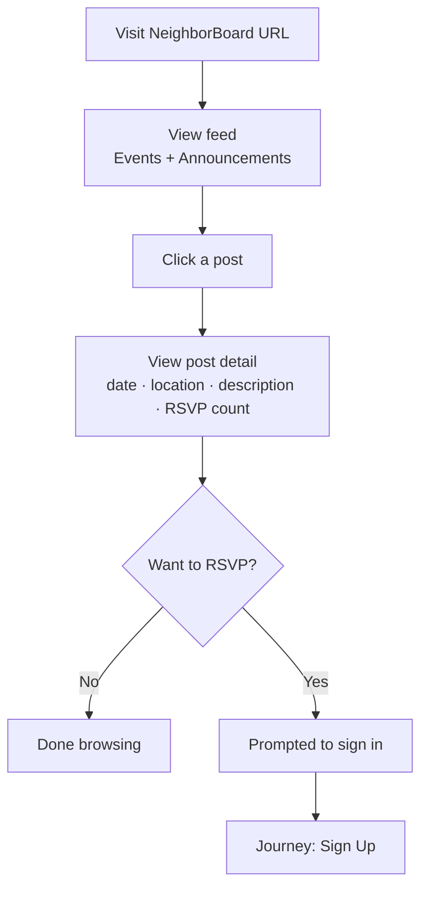
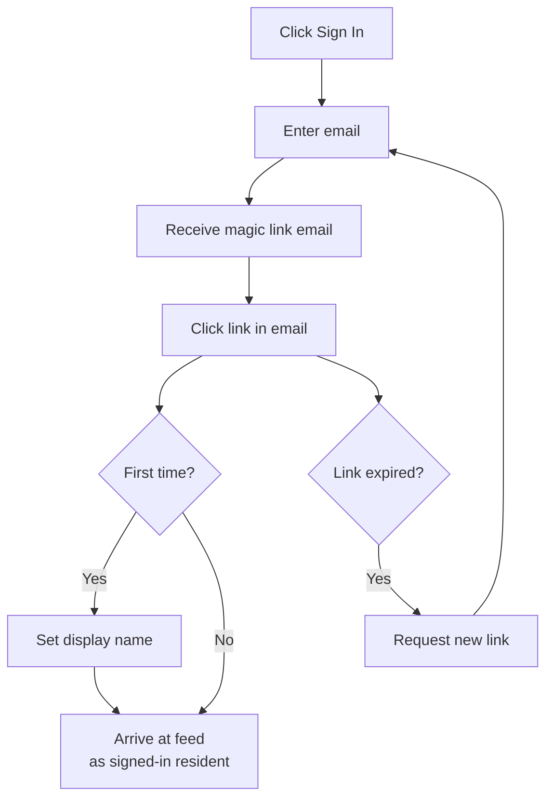
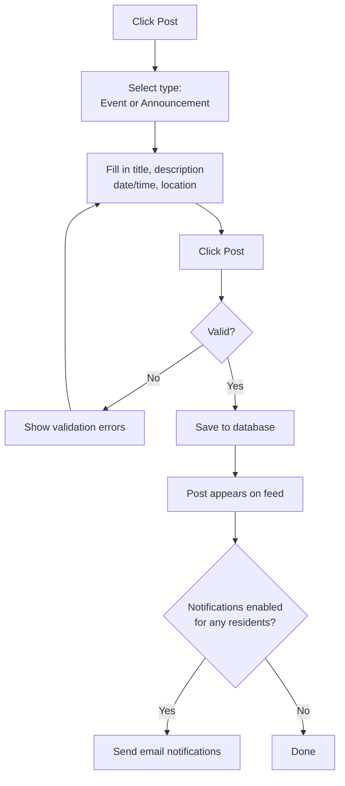

# USER_JOURNEYS.md — NeighborBoard Example

> This is a filled-in example. See the blank template at [`02-design/USER_JOURNEYS.md`](../../02-design/USER_JOURNEYS.md).

---

## Key User Journeys

1. Browse the neighborhood feed (no login required)
2. Sign up and join the neighborhood
3. Post an event
4. RSVP to an event

---

### Journey: Browse the Neighborhood Feed

A visitor wants to see what's happening in the neighborhood without creating an account.

**User:** Anyone — logged in or not

**Starting point:** Lands on the NeighborBoard URL for the neighborhood

**Steps:**
1. User sees the feed: a list of recent events and announcements, newest first
2. User can scroll through posts, see titles, dates, and a short preview
3. User clicks a post to see the full detail (date, location, description, RSVP count)
4. If user wants to RSVP, they're prompted to sign in

**End state:** User has seen upcoming neighborhood events without needing an account.

**Error states:** No posts yet → show an empty state message ("Nothing posted yet. Be the first to share something with your neighbors.")

---

### Journey: Sign Up and Join the Neighborhood

A resident wants to create an account so they can post and RSVP.

**User:** New resident, not yet registered

**Starting point:** Clicks "Sign in" or is prompted after trying to RSVP

**Steps:**
1. User enters their email address
2. System sends a magic link to that email (no password needed)
3. User opens their email and clicks the link
4. User is redirected back to NeighborBoard and is now signed in
5. On first login, user sets their display name (e.g., "Maria from Oak Ave")
6. User is now a member of the neighborhood and can post and RSVP

**End state:** User is logged in, has a display name, and is taken to the feed.

**Error states:**
- Email not received → "Check your spam folder. Resend link." button
- Link expired (links expire after 1 hour) → prompt to request a new one

---

### Journey: Post an Event

A resident wants to share an upcoming neighborhood event.

**User:** Logged-in resident

**Starting point:** Clicks "Post" on the feed

**Steps:**
1. User selects post type: "Event" or "Announcement"
2. User fills in: title, description, date & time, optional location
3. User clicks "Post"
4. System saves the post and displays it at the top of the feed
5. Optionally: system sends an email notification to residents who have notifications enabled

**End state:** The event appears on the feed for all residents to see.

**Error states:**
- Missing required field (title or date for events) → inline validation message
- Post fails to save → "Something went wrong. Try again." with the form still filled in

---

### Journey: RSVP to an Event

A resident wants to let the organizer know they're coming.

**User:** Logged-in resident

**Starting point:** Viewing an event detail page

**Steps:**
1. User sees "X people going" and an "RSVP" button
2. User clicks "RSVP"
3. Button changes to "You're going ✓" and count increments
4. User can click again to cancel their RSVP

**End state:** RSVP is recorded; organizer's count is updated.

**Error states:** If user is not logged in → prompt to sign in first, then return them to the event after login.

---

## Edge Cases and Exceptions

- **Past events:** Events with a date in the past should still be visible but clearly marked "Past Event." RSVP button is disabled.
- **Removed posts:** If an admin removes a post, it disappears from the feed. Users who navigate directly to its URL see "This post is no longer available."
- **Duplicate RSVP:** If a user tries to RSVP twice (e.g., opens the same event in two tabs), the second RSVP is silently ignored — the count doesn't double.

---

## Related

- [BUSINESS_LOGIC.md](../../02-design/BUSINESS_LOGIC.md)
- [DATA_MODEL.md](./DATA_MODEL.md)
- [Blank USER_JOURNEYS.md template](../../02-design/USER_JOURNEYS.md)
