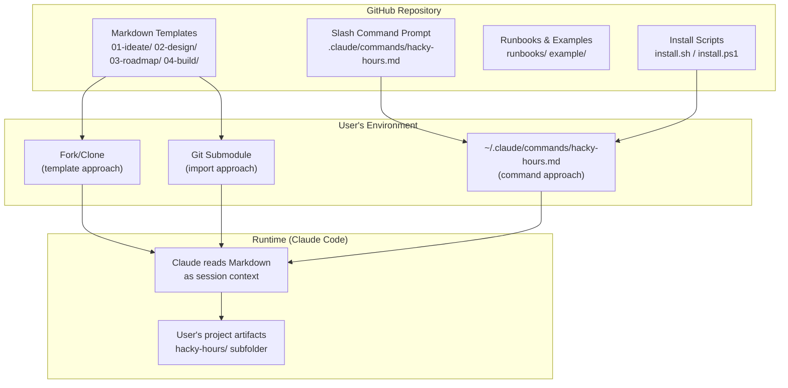

# ARCHITECTURE.md

**Level 2 — Design** | hacky-hours-docs

---

## System Overview

hacky-hours-docs is a zero-infrastructure documentation framework. There is no build system, no package manager, no test suite, and no runtime. The entire product is Markdown files. The "execution environment" is Claude Code reading these files as session context and acting on the embedded guidance.

## Architecture Diagram

## Delivery Mechanisms

### 1. Fork/Clone (template approach)
User forks the repo, deletes the example content, and fills in templates with their own product information. The root-level `01-ideate/`, `02-design/`, etc. folders serve as the templates.

### 2. Slash Command (primary approach)
User runs the install script, which copies the command prompt file to `~/.claude/commands/hacky-hours.md`. The command is then available as `/hacky-hours` in any Claude Code session. The command scaffolds a `hacky-hours/` subfolder in whatever repo the user is working in.

### 3. Git Submodule (import approach)
User adds this repo as a submodule and references it in their project's `CLAUDE.md`. Templates are available as read-only context.

## Key Components

| Component | Location | Purpose |
|-----------|----------|---------|
| Framework templates | `01-ideate/`, `02-design/`, `03-roadmap/`, `04-build/` | Blank templates users fill in |
| Slash command prompt | `.claude/commands/hacky-hours.md` | The guided assistant — routes arguments, scaffolds, facilitates |
| Example project | `example/` | Completed fictional project (NeighborBoard) showing filled-in docs |
| Runbooks | `runbooks/` | Getting started guides, starter prompts, setup instructions |
| Install scripts | `install.sh`, `install.ps1` | One-command install for macOS/Linux and Windows |
| Glossary | `GLOSSARY.md` | Plain-language definitions for technical terms |

## Known Fragility

The slash command prompt (`.claude/commands/hacky-hours.md`) is the most complex component. It has been built incrementally over releases and contains:
- Argument routing logic
- Full guidance for all four levels
- Scaffold, iterate, sync, audit, adopt, and migrate workflows
- Safety-first design philosophy embedded throughout

This prompt needs harmonization to ensure consistency, backward compatibility with existing artifacts, and a sustainable, scalable process as new features are added. Changes to the command prompt affect every user on next install — there is no gradual rollout mechanism.

## Design Decisions

*No ADRs yet. Future decisions should be recorded in `02-design/decisions/`.*
